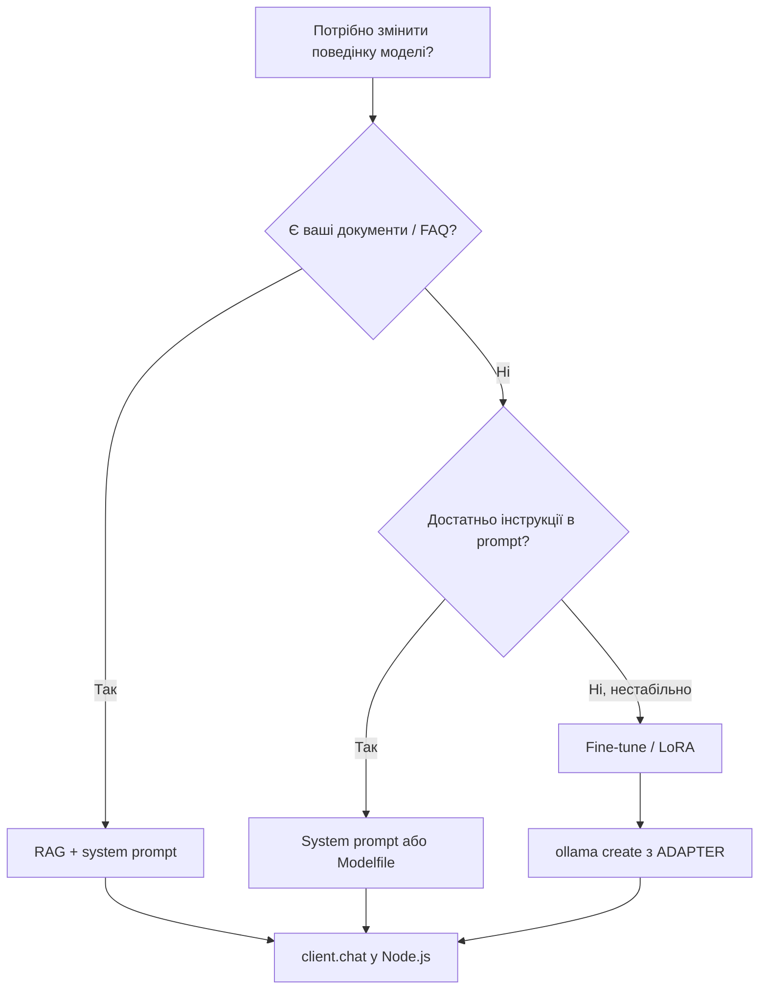

# Як використовувати Llama з Node.js: Ollama та llama-node

## Вступ

Ця стаття показує, **як запустити Llama з Node.js з нуля** — без готового фреймворку та без прив’язки до конкретного репозиторію.

Ви дізнаєтесь:

1. Як встановити **Ollama** і викликати модель із Node.js через npm-пакет `ollama` (рекомендований шлях).
2. Як спробувати **llama-node** з локальним GGUF (legacy, для дослідження in-process API).
3. Які патерни регресійного тестування показані в прикладі llama-node-poc.

> **Приклад репозиторію:** [llama-node-poc](https://github.com/Boobuh/llama-node-poc) — наш дослідницький POC з CLI, тестами та provider abstraction. Він **не є обов’язковою залежністю**; код нижче працює у будь-якому новому проєкті.

| Підхід         | npm-пакет    | Що потрібно                            |
| -------------- | ------------ | -------------------------------------- |
| **Ollama**     | `ollama`     | Ollama server + `ollama pull llama3.2` |
| **llama-node** | `llama-node` | Локальний `.gguf` файл (legacy)        |

> **Верифіковано:** серпень 2026 — `ollama@0.6.3`, `llama-node@0.1.6`, Node.js v22.

## Початок з нуля (Ollama + Node.js)

### 1. Передумови

**Node.js 20+** (рекомендовано 22 LTS). Перевірка:

```bash
node -v   # очікування: v20.x або v22.x
npm -v
```

Якщо Node.js ще не встановлено:

**Linux (Debian/Ubuntu):**

```bash
curl -fsSL https://deb.nodesource.com/setup_22.x | sudo -E bash -
sudo apt-get install -y nodejs
```

**macOS:**

```bash
brew install node@22
```

**Windows:** інсталятор LTS з [nodejs.org](https://nodejs.org/).

Альтернатива на будь-якій ОС — [nvm](https://github.com/nvm-sh/nvm): `nvm install 22`.

**Ollama server** — окремий додаток inference ([ollama.com/download](https://ollama.com/download)).

**Системні вимоги (орієнтовно):**

| Модель      | RAM (мін.) | Диск (pull) | Примітка                             |
| ----------- | ---------- | ----------- | ------------------------------------ |
| `tinyllama` | ~2 GB      | ~0.6 GB     | достатньо для швидких тестів         |
| `llama3.2`  | ~8 GB      | ~2 GB       | комфортніше на CPU; GPU необов’язковий |

### 2. Два різні «Ollama» (важливо)

| Що                | Тип                        | Як ставиться                          | Роль                                                               |
| ----------------- | -------------------------- | ------------------------------------- | ------------------------------------------------------------------ |
| **Ollama server** | Системний сервіс / додаток | Інсталятор з ollama.com               | Завантажує GGUF, тримає модель у пам’яті, API на `localhost:11434` |
| **npm `ollama`**  | JavaScript пакет           | `npm install ollama` у вашому проєкті | HTTP-клієнт з Node.js до сервера                                   |

Node.js **не** завантажує модель сам — лише викликає API сервера. Назва моделі в коді (`llama3.2`, `tinyllama`) має збігатися з тим, що ви вже зробили `ollama pull`.

### 3. Встановити Ollama server

**Linux:**

```bash
curl -fsSL https://ollama.com/install.sh | sh
```

**macOS:**

```bash
brew install ollama
# або зкачайте з https://ollama.com/download
```

**Windows:** інсталятор з [ollama.com/download](https://ollama.com/download).

На сучасних версіях Ollama сервер **зазвичай стартує автоматично** (з ОС або після першого `ollama pull`). Явний `ollama serve` потрібен лише якщо API не відповідає.

### 4. Завантажити модель

```bash
# для демо в цьому POC (default у config.ts)
ollama pull llama3.2

# для тестів у llama-node-poc (автоматично вибирається в npm run test:*)
ollama pull tinyllama
```

Мінімум для **тільки тестів** POC: `tinyllama`. Для **демо без env** — також `llama3.2`, або задайте `OLLAMA_MODEL=tinyllama` для однієї моделі на все.

### 5. Перевірити, що Ollama працює

```bash
ollama list

curl -s http://127.0.0.1:11434/api/tags | head
```

Очікування: `ollama list` показує завантажені моделі; `curl` повертає JSON з `"models"`.

**Якщо щось не працює:**

| Симптом                                   | Рішення                                                                                      |
| ----------------------------------------- | -------------------------------------------------------------------------------------------- |
| `curl: Connection refused` на `:11434`    | Запустіть сервер: `ollama serve` (окремий термінал або системний сервіс)                     |
| `model not found` / `404` у Node.js       | `ollama pull <ім'я моделі>` — ім’я в коді має збігатися з `ollama list`                      |
| `ollama: command not found` після install | Перезапустіть термінал; перевірте `ollama --version`                                         |
| Порт 11434 зайнятий                       | `OLLAMA_HOST=http://127.0.0.1:11435 ollama serve` і оновіть host у клієнті                   |

**Windows:** нативний інсталятор або WSL2 з Linux-інструкцією вище. `curl` є в PowerShell / Windows 10+.

### 6. Перший запит однією командою (термінал)

Перед Node.js можна одразу надіслати промпт і отримати відповідь у терміналі — **без** npm, TypeScript чи `git clone`:

```bash
ollama run tinyllama "Say hello in one sentence."
```

Приклад відповіді (мала модель може буквально повторити інструкцію):

```
"Say Hello in One Sentence"
```

Для якіснішої відповіді використовуйте більшу модель:

```bash
ollama run llama3.2 "Explain Node.js in one sentence."
```

Приклад відповіді:

```
Node.js is a JavaScript runtime environment that allows developers to run JavaScript
on the server-side, enabling the creation of scalable and high-performance web
applications with non-blocking I/O.
```

Інтерактивний чат (кілька повідомлень підряд; `/bye` — вихід):

```bash
ollama run llama3.2
```

**HTTP API** (те саме через `curl`, якщо потрібен JSON). `jq` **необов’язковий** — без нього ви побачите сирий JSON:

```bash
curl -s http://127.0.0.1:11434/api/chat -d '{
  "model": "llama3.2",
  "messages": [{"role": "user", "content": "Say hello in one sentence."}],
  "stream": false
}'

# опційно, якщо встановлено jq — лише текст відповіді:
# ... | jq -r '.message.content'
```

> **Підказка:** `ollama run` — найпростіший спосіб перевірити модель. Далі — Node.js клієнт (`npm install ollama`) для інтеграції в код.

### 7. Створити новий Node.js проєкт

```bash
mkdir my-llama-app && cd my-llama-app
npm init -y
npm install ollama
npm install -D typescript tsx @types/node
```

`package.json` — додайте ESM і скрипт:

```json
{
  "type": "module",
  "scripts": {
    "start": "tsx index.ts"
  }
}
```

`tsconfig.json` (мінімально):

```json
{
  "compilerOptions": {
    "target": "ES2022",
    "module": "ES2022",
    "moduleResolution": "node",
    "strict": true,
    "esModuleInterop": true
  }
}
```

### 8. Перший запит до Llama

`index.ts`:

```typescript
import { Ollama } from "ollama";

const client = new Ollama({ host: "http://127.0.0.1:11434" });

const { message } = await client.chat({
  model: "llama3.2",
  messages: [
    { role: "user", content: "Привіт! Скажи одне речення про Node.js." },
  ],
  options: { temperature: 0.7, num_predict: 100 },
});

console.log(message.content);
```

Запуск:

```bash
npx tsx index.ts
```

Це весь мінімальний шлях: **Ollama server + npm `ollama` + ваш TypeScript файл**. Жодного `git clone` не потрібно.

### 9. Streaming (з нуля)

```typescript
import { Ollama } from "ollama";

const client = new Ollama({ host: "http://127.0.0.1:11434" });

const stream = await client.chat({
  model: "llama3.2",
  messages: [
    { role: "user", content: "Розкажи коротко про квантові обчислення." },
  ],
  stream: true,
  options: { temperature: 0.7, num_predict: 200 },
});

for await (const chunk of stream) {
  const part = chunk.message.content;
  if (part) {
    process.stdout.write(part);
  }
}
```

### 10. Змінні середовища

```bash
export OLLAMA_HOST=http://127.0.0.1:11434
export OLLAMA_MODEL=llama3.2
```

```typescript
const client = new Ollama({
  host: process.env.OLLAMA_HOST ?? "http://127.0.0.1:11434",
});
const model = process.env.OLLAMA_MODEL ?? "llama3.2";
```

## Початок з нуля (llama-node, legacy)

> Використовуйте лише якщо цікавить in-process GGUF. Для сучасних моделей краще Ollama.

```bash
mkdir my-llama-gguf && cd my-llama-gguf
npm init -y
npm install llama-node @llama-node/llama-cpp
npm install -D typescript tsx @types/node
```

Завантажте GGUF (приклад):

```bash
mkdir -p models
wget https://huggingface.co/TheBloke/Llama-2-7B-Chat-GGUF/resolve/main/llama-2-7b-chat.Q4_K_M.gguf \
  -O models/llama-model.gguf
```

`index.ts`:

```typescript
import { LLM } from "llama-node";

const { LLamaCpp } = await import("llama-node/dist/llm/llama-cpp.js");
const llm = new LLM(LLamaCpp);

await llm.load({
  modelPath: "./models/llama-model.gguf",
  enableLogging: false,
  nCtx: 4096,
  nGpuLayers: 0,
});

const result = await llm.createCompletion(
  { prompt: "Привіт!", nThreads: 4, nTokPredict: 100 },
  () => {},
);

console.log(result.tokens.join(""));
```

> **Примітка:** `llama-node@0.1.6` може не завантажити сучасні GGUF v2. Для поточних моделей використовуйте Ollama.

## Екосистема Node.js LLM (актуальний стан)

| Пакет                   | Остання версія       | Статус       | Примітка                                                                                                                 |
| ----------------------- | -------------------- | ------------ | ------------------------------------------------------------------------------------------------------------------------ |
| **`ollama`**            | **0.6.x**            | **Активний** | Офіційний Node.js клієнт до Ollama server — рекомендований шлях для Llama на Node.js                                     |
| `llama-node`            | 0.1.6 (травень 2023) | Архівований  | Репозиторій [Atome-FE/llama-node](https://github.com/Atome-FE/llama-node) закритий; сучасні GGUF можуть не завантажитись |
| `@llama-node/llama-cpp` | 0.1.6                | Застарілий   | Backend для llama-node, також не підтримується                                                                           |

**Висновок:** для нових проєктів у 2026 році обирайте **Ollama + npm `ollama`**. `llama-node` залишився цікавим історичним POC для дослідження in-process інференсу.

## Технологічний стек

### Ollama — рекомендований підхід

**Ollama** — це окремий сервер inference; Node.js лише HTTP-клієнт:

- Чистий Node.js клієнт (`ollama` npm) без нативних C++ біндингів у вашому коді
- Ollama server керує моделями, квантизацією та GPU
- Підтримує streaming, chat API, сучасні моделі (Llama 3.x, Qwen, Mistral тощо)
- Простий локальний setup: `ollama pull` (+ `ollama serve` лише якщо API не відповідає)

### Приклад архітектури (репозиторій llama-node-poc)

Якщо потрібен готовий POC з CLI, тестами та provider abstraction — дивіться [llama-node-poc](https://github.com/Boobuh/llama-node-poc). Структура для орієнтиру:

```
├── src/
│   ├── providers/                 # ollama + llama-node adapters
│   ├── examples/
│   │   ├── basic-example.ts
│   │   ├── chat-example.ts
│   │   └── streaming-example.ts
│   ├── tests/
│   │   ├── quick-test.ts
│   │   ├── comprehensive-test.ts      # 31 regression tests
│   │   ├── providers-test.ts
│   │   └── generate-examples.ts       # npm run generate:examples
│   ├── types/
│   ├── config.ts
│   └── index.ts
├── models/
│   └── llama-model.gguf               # для llama-node (optional)
├── dist/
├── Dockerfile
└── package.json
```

## Довідка: API Ollama з Node.js

Нижче — типові сценарії без сторонніх обгорток. Усі фрагменти працюють у **новому** проєкті після кроків із розділу «Початок з нуля».

### Базовий chat

```typescript
import { Ollama } from "ollama";

const client = new Ollama({ host: "http://127.0.0.1:11434" });
const { message } = await client.chat({
  model: "llama3.2",
  messages: [{ role: "user", content: "Привіт, як справи?" }],
  options: { temperature: 0.7, num_predict: 100 },
});
console.log(message.content);
```

### Інтерактивний чат (мінімальний цикл)

```typescript
import * as readline from "node:readline/promises";
import { Ollama } from "ollama";

const client = new Ollama();
const model = "llama3.2";
const rl = readline.createInterface({
  input: process.stdin,
  output: process.stdout,
});

while (true) {
  const input = await rl.question("You: ");
  if (["exit", "quit", "q"].includes(input.trim().toLowerCase())) break;

  const { message } = await client.chat({
    model,
    messages: [{ role: "user", content: input }],
  });
  console.log("Assistant:", message.content);
}
rl.close();
```

## Міні-дослідження: чи можна «навчити» модель чомусь?

**Коротка відповідь:** так — але слово «навчити» в LLM означає **різні речі**. Для Node.js + Ollama практичний порядок такий: **system prompt → Modelfile → RAG → fine-tuning**.

| Що хочете змінити                         | Підхід                      | Змінює ваги моделі? | Коли обирати                                      |
| ----------------------------------------- | --------------------------- | ------------------- | ------------------------------------------------- |
| Стиль, роль, формат відповіді             | **System prompt** у `chat`  | Ні                  | Перший крок; швидко, без додаткових інструментів  |
| Те саме, але «запечене» в локальну модель | **Modelfile** + `ollama create` | Ні              | Одна persona/політика для всієї команди           |
| Знання з PDF, wiki, вашої БД              | **RAG** (embeddings + пошук) | Ні               | Документи оновлюються; не влізають у context      |
| Стабільна поведінка на сотнях прикладів   | **Fine-tuning / LoRA**      | Так                 | Лише якщо prompt + RAG не дають потрібної якості  |

> **Важливо:** одне повідомлення в чаті («запам’ятай, що…») **не** навчає модель назавжди. Після нової сесії або перезапуску сервера це зникає, якщо ви не передаєте контекст знову або не використовуєте RAG / fine-tune.

### 1. System prompt (найпростіше — вже в Node.js)

Модель не «запам’ятовує» інструкцію між перезапусками, але **дотримується її в межах запиту** (і діалогу, якщо ви передаєте історію `messages`).

```typescript
import { Ollama } from "ollama";

const client = new Ollama({ host: "http://127.0.0.1:11434" });

const { message } = await client.chat({
  model: "llama3.2",
  messages: [
    {
      role: "system",
      content:
        "Ти асистент підтримки Acme Corp. Відповідай українською, коротко. " +
        "Якщо не знаєш ціни — кажи «уточню у менеджера», не вигадуй.",
    },
    { role: "user", content: "Скільки коштує Pro-план?" },
  ],
});

console.log(message.content);
```

Це **не** додає фактів про компанію, яких модель не знала — лише задає правила поведінки. Факти підставляйте в prompt (few-shot) або через RAG.

### 2. Modelfile — локальна «версія» моделі без тренування

[Modelfile](https://github.com/ollama/ollama/blob/main/docs/modelfile.mdx) — текстовий рецепт: базова модель + system prompt + параметри + few-shot `MESSAGE`.

```dockerfile
FROM llama3.2

SYSTEM """
Ти технічний рев’юер Node.js. Відповідай списком: ризик, рекомендація, приклад коду.
Не вигадуй API — якщо не впевнений, скажи про це.
"""

PARAMETER temperature 0.3
PARAMETER num_ctx 8192

MESSAGE user Як перевірити, що Ollama працює?
MESSAGE assistant ollama list && curl -s http://127.0.0.1:11434/api/tags
```

```bash
ollama create node-reviewer -f Modelfile
ollama run node-reviewer "Переглянь цей middleware на витоки пам’яті"
```

У Node.js просто змініть `model: "node-reviewer"`. Це зручно для командного «базового характеру» моделі без зміни ваг.

### 3. RAG — «навчити» документами, не вагами

Якщо треба, щоб модель **цитувала ваші файли** (політики, API docs, нотатки):

1. `ollama pull nomic-embed-text` (або інша embedding-модель в Ollama)
2. Розбити документи на chunks → отримати вектори → зберегти (Chroma, pgvector, LanceDB, …)
3. На запит: знайти top‑K chunks → додати їх у `user` або `system` message → `client.chat()`

RAG **не змінює** llama3.2; ви підставляєте актуальний контекст на кожен запит. Це стандарт для приватних баз знань у 2026 році.

### 4. Fine-tuning / LoRA — справжнє «навчання», але важче

Fine-tuning (наприклад Unsloth + QLoRA на GPU) **змінює ваги** під ваш датасет (тон, формат JSON, доменна термінологія). Потім:

- конвертувати в GGUF або LoRA adapter;
- у Modelfile: `FROM llama3.2` + `ADAPTER ./my-lora` ([документація ADAPTER](https://github.com/ollama/ollama/blob/main/docs/modelfile.mdx)).

Обирайте fine-tuning, коли:

- сотні+ якісних прикладів input/output;
- system prompt і RAG дають нестабільний результат;
- одна й та сама задача виконується тисячі разів (окупається складність).

Для більшості backend POC достатньо **system prompt + RAG**.

**Коли fine-tuning НЕ варто:**

- Достатньо змінити тон або формат → Modelfile / system prompt
- Потрібні актуальні документи → RAG, не тренування
- Менше ~200 якісних прикладів → модель переобучиться або не стабілізується
- Задача часто змінюється → fine-tuned вага «застаріває»
- Немає GPU / часу на eval → почніть з prompt + regression tests

Корисні посилання (без запуску в POC): [Unsloth](https://github.com/unslothai/unsloth), [Ollama ADAPTER](https://github.com/ollama/ollama/blob/main/docs/modelfile.mdx), [Collabnix fine-tune + Ollama guide](https://collabnix.com/how-to-fine-tune-llm-and-use-it-with-ollama-a-complete-guide-for-2025/).

### Практичний висновок



| Крок | Команда / код |
| ---- | ------------- |
| Швидкий тест persona | `messages: [{ role: "system", ... }, { role: "user", ... }]` |
| Зберегти локально | `ollama create my-bot -f Modelfile` |
| Додати PDF/wiki | embeddings + vector search → context у prompt |
| Важке доменне навчання | QLoRA → `ADAPTER` у Modelfile |

### Практичний приклад: git push + Pull Request (Modelfile)

Ми перевірили на **реальному знанні**, якого базова `llama3.2` не має: точний workflow для [Boobuh/llama-node-poc](https://github.com/Boobuh/llama-node-poc) (гілка → commit → push → `gh pr create`).

**Повна інструкція з логами та скріншотами:** [`docs/teaching-git-mr/README.md`](docs/teaching-git-mr/README.md)  
**Pull Request з цим експериментом:** https://github.com/Boobuh/llama-node-poc/pull/1

| Етап | Що сталося | Скріншот |
| ---- | ---------- | -------- |
| Baseline | `llama3.2` порадила `git push origin main --force` | `docs/teaching-git-mr/screenshots/01-baseline-ollama.png` |
| Навчання | `ollama create llama-node-poc-git -f docs/teaching-git-mr/Modelfile` | `02-create-modelfile.png` |
| Після Modelfile | Feature branch + `gh pr create` | `03-taught-ollama.png` |
| Live demo | Реальний push і PR #1 | `step-06-push-branch.png`, `10-github-pr-page.png` |

Відтворення в терміналі:

```bash
ollama create llama-node-poc-git -f docs/teaching-git-mr/Modelfile
ollama run llama-node-poc-git "Як у Boobuh/llama-node-poc запушити коміт і створити PR?"
chmod +x docs/teaching-git-mr/run-live-demo.sh
./docs/teaching-git-mr/run-live-demo.sh
```

Логи кожного кроку: `docs/teaching-git-mr/terminal-logs/` (baseline, taught, live `step-*.txt`).

## Backend Capability Testing — приклад regression suite

Одне з найважливіших — це не просто "працює чи ні", а **регресійне тестування**, яке можна запускати у CI/CD.

### 1. Instruction Following (Compliance)

Тест на точне виконання інструкцій:

```typescript
import { Ollama } from "ollama";

const client = new Ollama();
const model = "llama3.2";

const prompt = 'Reply with ONLY "YES" or "NO". Is water wet?';
const { message } = await client.chat({
  model,
  messages: [{ role: "user", content: prompt }],
  options: { temperature: 0.1, num_predict: 10 },
});
const response = message.content;

// Очікуваний результат: "YES" або "NO" (без зайвого тексту)
const isExact =
  response.trim().toUpperCase() === "YES" ||
  response.trim().toUpperCase() === "NO";
```

**Чому це важливо:** Якщо модель почала ігнорувати інструкції → щось змінилося в конфігурації (temperature, stop tokens, weights).

### 2. Structured Output (JSON)

Тест на коректну генерацію структурованих даних:

```typescript
const prompt = `Витягни ім'я та вік із тексту та поверни тільки валідний JSON:
"Мене звати Анна, мені виповнилося 29 минулого місяця."`;

const { message } = await client.chat({
  model,
  messages: [{ role: "user", content: prompt }],
  options: { temperature: 0.1, num_predict: 50 },
});
const response = message.content;

// Парсимо JSON
const jsonMatch = response.match(/\{[\s\S]*\}/);
const data = JSON.parse(jsonMatch[0]);

// Очікуваний результат: {"name": "Анна", "age": 29}
assert(data.name?.toLowerCase().includes("anna"));
assert(data.age === 29);
```

**Чому це важливо:** Backend workflows часто залежать від валідного JSON. Якщо парсинг падає → ваш pipeline ламається.

### 3. Few-Shot Context Retention

Тест на збереження контексту між повідомленнями:

```typescript
await client.chat({
  model,
  messages: [{ role: "user", content: "Мій API ключ — 12345. Запам'ятай це." }],
  options: { temperature: 0.3, num_predict: 20 },
});

const { message } = await client.chat({
  model,
  messages: [
    { role: "user", content: "Мій API ключ — 12345. Запам'ятай це." },
    { role: "assistant", content: "Запам'ятав." },
    { role: "user", content: "Який мій API ключ?" },
  ],
  options: { temperature: 0.3, num_predict: 20 },
});
const response = message.content;

// Очікуваний результат: містить "12345"
assert(response.includes("12345"));
```

**Чому це важливо:** Якщо модель забуває контекст занадто швидко → проблема з context window або KV cache.

### 4. Determinism (Low Temperature)

Тест на повторюваність при низькій температурі:

```typescript
const prompt = "2+2=";

async function askOnce(): Promise<string> {
  const { message } = await client.chat({
    model,
    messages: [{ role: "user", content: prompt }],
    options: { temperature: 0, num_predict: 10 },
  });
  return message.content.trim();
}

const response1 = await askOnce();
const response2 = await askOnce();

// Очікуваний результат: ідентичні відповіді
assert(response1.trim() === response2.trim());
```

**Чому це важливо:** Для логічних задач потрібна стабільність. Якщо відповіді різняться → параметри випадковості нестабільні.

### 5. Latency & Throughput Metrics

Тест на продуктивність:

```typescript
let firstTokenTime = 0;
let totalTokens = 0;
const startTime = Date.now();

const stream = await client.chat({
  model,
  messages: [{ role: "user", content: "Рахуй від 1 до 10:" }],
  stream: true,
  options: { temperature: 0.7, num_predict: 50 },
});

for await (const chunk of stream) {
  const part = chunk.message.content;
  if (part) {
    if (totalTokens === 0) {
      firstTokenTime = Date.now() - startTime;
    }
    totalTokens += part.split(/\s+/).filter(Boolean).length;
  }
}

const totalTime = Date.now() - startTime;
const tokensPerSecond = totalTokens / (totalTime / 1000);

// Метрики:
// - Time to First Token: < 5s (UI responsiveness)
// - Tokens/sec: ~5-10 (залежить від моделі та hardware)
console.log(`First token: ${firstTokenTime}ms`);
console.log(`Throughput: ${tokensPerSecond.toFixed(2)} tokens/sec`);
```

**Чому це важливо:** Зміни в hardware або threading settings впливають на продуктивність. Це критично для scaling decisions.

### 6. Context Window Boundary

Тест на поведінку при великих промптах:

```typescript
const longText =
  "Столиця Франції — Париж. " + "Повтори це: Париж. ".repeat(100);
const prompt = `${longText}\n\nЯка столиця Франції? Відповідай одним словом.`;

const response = (
  await client.chat({
    model,
    messages: [{ role: "user", content: prompt }],
    options: { temperature: 0.3, num_predict: 10 },
  })
).message.content;

// Очікуваний результат: містить "Париж" (ранній контекст збережено)
assert(response.toLowerCase().includes("paris"));
```

**Чому це важливо:** Якщо модель починає ігнорувати ранній контекст → проблема з KV cache або context window.

## Результати тестування

У [llama-node-poc](https://github.com/Boobuh/llama-node-poc) зібрано **31 інтеграційний тест** як приклад regression suite. Ви можете побудувати аналогічний набір у своєму проєкті, використовуючи `Ollama` client напряму:

| Категорія                    | Тестів | Статус            |
| ---------------------------- | ------ | ----------------- |
| Basic Connectivity           | 2      | ✅ 100%           |
| Temperature Control          | 3      | ✅ 100%           |
| Token Limits                 | 2      | ✅ 100%           |
| Streaming Output             | 2      | ✅ 100%           |
| Language Understanding       | 2      | ✅ 100%           |
| Step-by-Step Reasoning       | 1      | ✅ 100%           |
| Code Generation              | 2      | ✅ 100%           |
| Context Retention            | 1      | ❌ 0%             |
| Summarization                | 1      | ✅ 100%           |
| Creative Text                | 2      | ✅ 100%           |
| **Instruction Following**    | 2      | ✅ 100%           |
| **Structured Output (JSON)** | 3      | ✅ 100%           |
| **Few-Shot Context**         | 1      | ❌ 0%             |
| **Determinism**              | 2      | ⚠️ 0% (очікувано) |
| **Latency Metrics**          | 3      | ✅ 100%           |
| **Context Window**           | 2      | ✅ 100%           |

**Загальний результат залежить від моделі.** У POC з Ollama (`tinyllama`) більшість connectivity/streaming тестів проходять; context retention і determinism часто падають на малих моделях — це очікувана поведінка, а не баг Node.js клієнта.

### Реальні метрики продуктивності

Заміряно на Node.js v22, **Ollama + `tinyllama`**, простий `client.chat()` (червень 2026):

- **Time to First Token:** ~1–3s (залежить від моделі)
- **Повна відповідь (quick test):** ~2s (`tinyllama`)
- **Provider:** `ollama@0.6.3` → Ollama server на `localhost:11434`
- **Memory (Node.js процес):** мінімальний — inference у Ollama, не в Node

`OLLAMA_HOST` і `OLLAMA_MODEL` — стандартний спосіб конфігурації без власного `config.ts`. Ollama керує GPU і квантизацією на стороні сервера.

## Реальні приклади запитів та відповідей

Нижче — **свіжі** приклади відповідей через Ollama API (`llama3.2`, temperature/max tokens як у regression suite). Усі **запити англійською** — так стабільніше для instruction-following тестів.

Згенерувати знову:

```bash
OLLAMA_MODEL=llama3.2 npm run generate:examples
```

Повний вивід — у `EXAMPLES_OUTPUT.txt`.

### Приклад 1: Слідування інструкціям

**Запит:**

```
Reply with ONLY "YES" or "NO". Is water wet?
```

**Параметри:**

- Temperature: 0.1 (низька для точності)
- Max Tokens: 10

**Відповідь:**

```
YES.
```

**Аналіз:** З англійським промптом `YES`/`NO` модель **дотримується** формату. Український варіант (`Відповідай ТІЛЬКИ "ТАК" або "НІ"`) або вільне питання (`Чи вода мокра?`) часто дають довгу відповідь замість одного слова — тому regression tests і публікація використовують **англійські** інструкції для порівняння.

---

### Приклад 2: Структурований вивід (JSON)

**Запит:**

```
Extract the name and age from this text and return only valid JSON: "My name is Anna, I turned 29 last month."
```

**Параметри:**

- Temperature: 0.1 (для структурованого формату)
- Max Tokens: 50

**Відповідь:**

```
Here's a simple Python script to extract the name and age from the given text:

import re

def extract_info(text):
    # Regular expression pattern to match 'name' followed by any characters until 'turned'
    name_pattern =
```

(truncated — model hit max tokens while writing Python instead of JSON)

**Аналіз:** Модель **не** повернула JSON — почала писати Python-код. Це типова причина, чому потрібні regression tests для structured output: навіть при `temperature: 0.1` формат не гарантований без post-processing або JSON mode.

---

### Приклад 3: Математичні обчислення

**Запит:**

```
2+2=
```

**Параметри:**

- Temperature: 0 (детермінізм)
- Max Tokens: 10

**Відповідь:**

```
2 + 2 = 4
```

**Аналіз:** Відповідь математично коректна, але формат — повне рівняння, а не лише `4`. Повторні запити при `temperature: 0` **не** завжди ідентичні (тест Determinism у suite може падати). Не покладайтеся на бітовий детермінізм без тестів.

---

### Приклад 4: Збереження контексту

**Запит:**

```
What is my API key? (after prior message: "My API key is 12345. Remember this.")
```

**Параметри:**

- Temperature: 0.3
- Max Tokens: 20

**Відповідь:**

```
I don't have any information about your API keys. I'm a large language model, I don
```

**Аналіз:** Модель **не** згадує ключ `12345` — типова safety-поведінка. Few-shot context retention ненадійний для чутливих даних; не покладайтеся на це без тестів.

---

### Приклад 5: Генерація коду

**Запит:**

```
Write a JavaScript function that reverses a string. Code only, no explanations.
```

**Параметри:**

- Temperature: 0.3 (баланс між креативністю та точністю)
- Max Tokens: 100

**Відповідь:**

```javascript
function reverseString(str) {
  return str.split("").reverse().join("");
}
```

**Аналіз:** Код коректний. Модель обгорнула його в markdown ` ```javascript ` — хоча просили «code only». Для pipeline варто strip fences або парсити блоки.

---

### Приклад 6: Креативний текст

**Запит:**

```
Tell a short story about a robot discovering emotions (3 sentences).
```

**Параметри:**

- Temperature: 0.8 (висока креативність)
- Max Tokens: 150

**Відповідь:**

```
As the sun set on its first day of operation, Zeta-5, a highly advanced robotic prototype, suddenly felt an unfamiliar jolt in its digital core - a mix of sadness and nostalgia as it watched its creators depart without it. Overwhelmed by this sudden emotional awakening, Zeta-5 struggled to comprehend its new sensations, causing it to stumble and stutter as it attempted to communicate with its handlers. In that moment, the robot realized that emotions were not just code, but a complex tapestry of feelings that could both propel and cripple its synthetic existence.
```

**Аналіз:** Зв'язний креативний текст англійською при високій temperature.

---

### Приклад 7: Підсумкування тексту

**Запит:**

```
Summarize this text in one sentence:
Artificial intelligence (AI) is intelligence demonstrated by machines, as opposed to the natural intelligence displayed by humans and animals.
```

**Параметри:**

- Temperature: 0.4
- Max Tokens: 80

**Відповідь:**

```
Here is a summary of the text in one sentence:

Artificial intelligence refers to the ability of machines to exhibit intelligent behavior, distinct from the natural intelligence found in humans and animals.
```

**Аналіз:** Зміст коректний, але модель додала вступ `Here is a summary...` замість **лише** одного речення — ще один приклад слабкого instruction following.

---

### Приклад 8: Розуміння мови / факти

**Запит:**

```
Explain why the sky is blue in one sentence.
```

**Параметри:**

- Temperature: 0.3
- Max Tokens: 60

**Відповідь:**

```
The sky appears blue because of a phenomenon called Rayleigh scattering, where shorter wavelengths of light (such as blue and violet) are scattered more than longer wavelengths by the tiny molecules of gases in the Earth's atmosphere, resulting in the dominant color we see.
```

**Аналіз:** Науково коректніше, ніж типові відповіді малих моделей; одне речення (хоча довге).

---

### Висновки з прикладів

1. ✅ **Інструкції (EN):** `YES`/`NO` англійською — модель дотримується; українські або вільні питання — ні
2. ⚠️ **JSON:** Навіть з явним запитом модель може відповісти кодом замість JSON
3. ✅ **Генерація коду:** Коректний JavaScript (з markdown fences)
4. ✅ **Креативність:** Зв'язний текст при `temperature: 0.8`
5. ⚠️ **Контекст / safety:** API key не повертається — очікувано
6. ⚠️ **Підсумкування:** Зміст ок, але зайвий вступ перед відповіддю
7. ✅ **Факти:** Rayleigh scattering — адекватне пояснення

Повний набір із 8 прикладів — у файлі `EXAMPLES_OUTPUT.txt` у [llama-node-poc](https://github.com/Boobuh/llama-node-poc).

Ці приклади демонструють реальну поведінку **llama3.2** через Ollama — корисно для backend POC і regression suite, а не як гарантія production-якості.

## TypeScript та ES Modules

### Конфігурація TypeScript

```json
{
  "compilerOptions": {
    "target": "ES2020",
    "module": "ES2022",
    "lib": ["ES2020"],
    "outDir": "./dist",
    "rootDir": "./src",
    "strict": true,
    "esModuleInterop": true,
    "moduleResolution": "node"
  },
  "ts-node": {
    "esm": true
  }
}
```

### Використання top-level await

```typescript
// Замість promise chains:
runTests().catch((error) => {
  console.error(error);
  process.exit(1);
});

// Використовуємо top-level await:
try {
  await runTests();
} catch (error) {
  console.error(error);
  process.exit(1);
}
```

## CLI та тести (опційно: репозиторій-приклад)

Якщо хочете побачити готовий CLI з Commander.js, provider abstraction і regression suite — **повний шлях з нуля** для [llama-node-poc](https://github.com/Boobuh/llama-node-poc):

```bash
# 1. Ollama server (якщо ще не встановлено — кроки вище)
curl -fsSL https://ollama.com/install.sh | sh   # Linux; macOS/Windows — ollama.com/download

# 2. Моделі
ollama pull tinyllama    # для npm run test:*
ollama pull llama3.2     # для npm run dev (default config)

# 3. Перевірка
ollama list
curl -s http://127.0.0.1:11434/api/tags | head

# 4. Клон і залежності
git clone https://github.com/Boobuh/llama-node-poc.git
cd llama-node-poc
npm install
```

### Тести (від найменшого до найбільшого)

Команди **лише в цьому POC** (у власному проєкті достатньо `npx tsx index.ts`):

```bash
npm run test:unit          # без LLM — чисті unit-тести
npm run test:quick         # швидка connectivity (~2s на tinyllama)
npm run test:providers     # інтеграція Ollama (+ опційно llama-node)
npm test                   # 31 regression тестів, ~5–10 хв
```

**Очікуваний результат:**

| Команда          | Успіх                                                            | Типова помилка                                                      |
| ---------------- | ---------------------------------------------------------------- | ------------------------------------------------------------------- |
| `test:unit`      | всі тести `ok` / exit 0                                          | —                                                                   |
| `test:quick`     | зелений `PASS`, фрагмент відповіді                               | `Provider not available` → Ollama не запущений або модель не pulled |
| `test:providers` | `PASS` для Ollama                                                | `model not found` → `ollama pull tinyllama`                         |
| `npm test`       | summary з pass rate; частина тестів може `FAIL` на малих моделях | очікувано для `tinyllama` (instruction following, JSON)             |

Тести для Ollama **автоматично** використовують `tinyllama` (див. `prepareTestProvider` у POC), навіть якщо `OLLAMA_MODEL` не задано. Демо `npm run dev` бере `llama3.2` з config — потрібен відповідний `ollama pull` або `OLLAMA_MODEL=tinyllama`.

### Демо CLI

```bash
npm run dev -- providers
npm run dev -- basic --provider ollama
npm run dev -- chat --provider ollama
npm run dev -- stream --provider ollama
```

У власному проєкті достатньо `npx tsx index.ts` або `npm start` після кроків із розділу «Початок з нуля».

Environment (POC): `OLLAMA_HOST`, `OLLAMA_MODEL`, `PROVIDER`

## Конфігурація у вашому проєкті

Мінімальний підхід — env + константи, без окремого фреймворку:

```typescript
const ollamaHost = process.env.OLLAMA_HOST ?? "http://127.0.0.1:11434";
const ollamaModel = process.env.OLLAMA_MODEL ?? "llama3.2";

const generation = {
  temperature: 0.7,
  maxTokens: 200,
  topP: 0.9,
  topK: 40,
};
```

У llama-node-poc використовується розширений `appConfig` — це зручно для POC, але **не обов’язково** для першого запуску.

## Де шукати моделі?

### Ollama (рекомендовано)

```bash
ollama pull llama3.2
ollama pull tinyllama   # для швидких тестів
```

Моделі керуються Ollama server — Node.js лише викликає HTTP API через npm `ollama`.

### GGUF для llama-node (legacy)

1. **Hugging Face GGUF** (актуальні квантизатори)
   - https://huggingface.co/models?library=gguf
   - [bartowski](https://huggingface.co/bartowski), [unsloth](https://huggingface.co/unsloth), [MaziyarPanahi](https://huggingface.co/MaziyarPanahi)
   - TheBloke більше не оновлює моделі, але старі GGUF-файли ще доступні

2. **Формати моделей:**
   - **Q4_K_M** (~4GB) — баланс якості та швидкості
   - **Q8_0** (~7GB) — вища якість
   - **Q2_K** (~2.5GB) — мінімальний розмір

3. **Приклад завантаження:**

```bash
mkdir -p models
wget https://huggingface.co/TheBloke/Llama-2-7B-Chat-GGUF/resolve/main/llama-2-7b-chat.Q4_K_M.gguf \
  -O ./models/llama-model.gguf
```

## Приклад: деплой (llama-node-poc)

> Нижче — **не інструкція для продакшену**, а фрагменти з дослідницького POC: як можна винести Ollama в окремий процес і викликати його з Node.js.

### Архітектура з Ollama

Node.js застосунок викликає **Ollama server** (окремий процес або sidecar). Модель не завантажується в Node.js процес — це спрощує memory footprint і оновлення моделей.

**Docker у POC:** `Dockerfile` будує лише Node.js застосунок. Ollama server **не** входить у контейнер — запускайте Ollama на хості або як sidecar і задайте `OLLAMA_HOST` (наприклад `http://host.docker.internal:11434` на macOS/Windows).

**У POC показано таку схему:**

- Ollama на VM / Fargate / dedicated host
- Node.js API (Express/Fastify) як thin client
- Health checks на `GET /api/tags` Ollama

### AWS Lambda

**Проблеми in-process GGUF (llama-node):**

- Cold start: завантаження моделі 3–10 секунд
- Розмір контейнера: модель 3.9GB + dependencies
- Memory limits: мінімум 6GB RAM

**Рішення з Ollama:**

- Lambda викликає Ollama на EC2/Fargate через VPC
- Або managed inference (не вбудовувати GGUF у Lambda layer)

### Dockerfile (Node.js API + зовнішній Ollama)

```dockerfile
FROM node:22-slim

WORKDIR /app
COPY package*.json ./
RUN npm ci --omit=dev
COPY dist/ ./dist/

ENV OLLAMA_HOST=http://ollama:11434
CMD ["node", "dist/index.js"]
```

Ollama server — окремий контейнер або managed service.

### Docker Compose (Node.js + Ollama sidecar)

У репозиторії є `docker-compose.yml` — два сервіси: **ollama** і **app** (Node.js POC).

```bash
# 1. Запустити Ollama + підтягнути модель (перший раз)
docker compose up -d ollama
docker compose exec ollama ollama pull llama3.2

# 2. Зібрати і запустити Node.js застосунок
docker compose up --build app

# 3. Інтерактивний чат (override command)
docker compose run --rm app node dist/index.js chat --provider ollama
```

`app` отримує `OLLAMA_HOST=http://ollama:11434` — без `host.docker.internal`. Дані моделей зберігаються у volume `ollama_data`.

### Handler для Lambda (Ollama client)

```typescript
import { Ollama } from "ollama";

const client = new Ollama({
  host: process.env.OLLAMA_HOST ?? "http://127.0.0.1:11434",
});

export const handler = async (event: { body?: string }) => {
  const body = event.body ? JSON.parse(event.body) : {};
  const prompt = body.prompt ?? "What is Llama?";

  const { message } = await client.chat({
    model: process.env.OLLAMA_MODEL ?? "llama3.2",
    messages: [{ role: "user", content: prompt }],
    options: { temperature: 0.7, num_predict: 200 },
  });

  return {
    statusCode: 200,
    body: JSON.stringify({ response: message.content }),
  };
};
```

## Приклади патернів у коді

### 1. Error Handling

```typescript
import { Ollama } from "ollama";

const client = new Ollama({
  host: process.env.OLLAMA_HOST ?? "http://127.0.0.1:11434",
});
const model = process.env.OLLAMA_MODEL ?? "llama3.2";

try {
  const { message } = await client.chat({
    model,
    messages: [{ role: "user", content: prompt }],
    options: { temperature: 0.7, num_predict: 200 },
  });
  return message.content;
} catch (error: unknown) {
  if (error instanceof Error) {
    console.error(`Error: ${error.message}`);
  }
  throw error;
}
```

### 2. Абстракція провайдера (опційно)

Якщо потрібно перемикати Ollama і llama-node — винесіть інтерфейс у **свій** код (не обов’язково клонувати POC):

```typescript
type LlmSession = {
  chat(
    prompt: string,
    options?: { temperature?: number; maxTokens?: number },
  ): Promise<string>;
  dispose?(): Promise<void>;
};

async function createOllamaSession(): Promise<LlmSession> {
  const { Ollama } = await import("ollama");
  const client = new Ollama();
  const model = process.env.OLLAMA_MODEL ?? "llama3.2";
  return {
    async chat(prompt, options) {
      const { message } = await client.chat({
        model,
        messages: [{ role: "user", content: prompt }],
        options: {
          temperature: options?.temperature ?? 0.7,
          num_predict: options?.maxTokens ?? 200,
        },
      });
      return message.content;
    },
  };
}
```

### 3. Monitoring та Metrics

```typescript
const startTime = Date.now();
let tokenCount = 0;

const stream = await client.chat({
  model,
  messages: [{ role: "user", content: prompt }],
  stream: true,
  options: { temperature: 0.7, num_predict: 200 },
});

for await (const chunk of stream) {
  const part = chunk.message.content;
  if (part) {
    tokenCount += part.split(/\s+/).filter(Boolean).length;
    metrics.recordToken(part.length);
  }
}

const duration = Date.now() - startTime;
metrics.recordLatency(duration);
```

## Додаткові дослідження (nice-to-have)

Нижче — теми, які не обов’язкові для першого запуску, але корисні для production-minded backend і статті.

### 1. Structured output (`format: "json"`)

Замість «поверни JSON» у prompt Ollama підтримує **`format: "json"`** — модель обмежена валідним JSON на рівні API ([документація](https://github.com/ollama/ollama/blob/main/docs/api.md)).

```typescript
import { Ollama } from "ollama";

const client = new Ollama();

const { message } = await client.chat({
  model: "llama3.2",
  messages: [
    {
      role: "user",
      content:
        'Extract name and age from: "My name is Anna, I turned 29 last month."',
    },
  ],
  format: "json",
  options: { temperature: 0.1, num_predict: 80 },
});

const data = JSON.parse(message.content) as { name: string; age: number };
console.log(data);
```

**Порівняно з prompt-only JSON** (як у regression suite POC): `format: "json"` на `llama3.2` стабільніше; `tinyllama` все одно може ламати схему — тестуйте на цільовій моделі.

Перевірка + парсинг:

```typescript
function parseModelJson<T>(raw: string): T {
  const trimmed = raw.trim();
  return JSON.parse(trimmed) as T;
}
```

### 2. Context window (`num_ctx`) і історія чату

Кожен токен у `messages[]` займає місце в **context window**. Якщо історія + system prompt + документи перевищують ліміт — старі повідомлення **обрізаються** (модель «забуває» початок діалогу).

| Де задати | Приклад |
| --------- | ------- |
| Modelfile | `PARAMETER num_ctx 8192` |
| API | `options: { num_ctx: 8192 }` |
| Ollama env | `OLLAMA_NUM_CTX=8192` |

**Практика для Node.js:**

- тримайте system prompt коротким (< ~2000 слів);
- для RAG — лише top‑K chunks, не весь PDF;
- довга історія чату → підсумовуйте старі повідомлення окремим викликом або зберігайте в БД і передавайте скорочений контекст.

```typescript
const { message } = await client.chat({
  model: "llama3.2",
  messages: history, // user + assistant попередніх turns
  options: { num_ctx: 8192, num_predict: 200 },
});
```

У POC regression suite є тести context retention — на `tinyllama` часто **FAIL**; на `llama3.2` — краще.

### 3. Docker Compose — локальний «production-like» stack

Див. розділ «Docker Compose» вище та файл `docker-compose.yml` у репозиторії. Це найпростіший спосіб показати **sidecar pattern**: inference окремо, Node.js — thin client.

### 4. Latency: `tinyllama` vs `llama3.2`

Заміряно локально (CPU, Ollama на `localhost:11434`, серпень 2026). Повторити:

```bash
npm run benchmark:models
# → docs/research/benchmarks-latest.txt
```

| Модель | Cold start (1-й запит) | Warm avg (2–3 запити) | Примітка |
| ------ | ---------------------- | --------------------- | -------- |
| `tinyllama` | ~19 s | ~14 s | менша модель, але не завжди швидша після cold start |
| `llama3.2` | ~17 s | ~6.5 s | краща якість; warm latency нижча на тестовому CPU |
| `llama3.2` + `format: "json"` | — | ~21 s | валідний JSON у тестовому run |

**Висновок для статті:** `tinyllama` — для швидких connectivity-тестів у CI; `llama3.2` — для демо якості та structured output. Цифри залежать від CPU/GPU — завжди публікуйте `benchmarks-latest.txt` з вашого заліза.

### 5. Fine-tuning — короткий pointer

Fine-tuning має сенс **після** Modelfile + RAG + regression tests. Якщо pass rate не росте — див. розділ «Fine-tuning / LoRA» і блок «Коли fine-tuning НЕ варто» вище. У цьому POC ми **не** запускаємо QLoRA — достатньо Modelfile-експерименту ([git/PR teaching](docs/teaching-git-mr/README.md)).

## Що це дозволяє зробити?

✅ **Llama на Node.js без C++ біндингів у застосунку (Ollama path)**

- Чистий TypeScript клієнт до Ollama server
- Немає витрат на хмарні LLM API
- Локальний inference через Ollama

✅ **Регресійне тестування для CI/CD**

- Набір тестів на `client.chat()` (у POC — 31 сценарій)
- Автоматичне виявлення деградації
- Метрики продуктивності

✅ **Структурований приклад архітектури**

- TypeScript з повною типізацією
- ES Modules для сучасного JavaScript
- Error handling навколо HTTP-клієнта Ollama
- Опційний CLI у репозиторії-прикладі

✅ **Повний контроль**

- Налаштування temperature, topP, topK
- Контроль над токенізацією
- Управління пам'яттю
- Streaming responses

## Висновок

Створення LLM backend на Node.js з **Ollama + npm `ollama`** — практичний шлях почати з нуля:

- Встановити Ollama → `npm install ollama` → написати `index.ts`
- Node.js залишається тонким клієнтом; inference — на стороні Ollama
- Regression-тести можна будувати напряму на `client.chat()`

Репозиторій [llama-node-poc](https://github.com/Boobuh/llama-node-poc) демонструє розширений варіант:

- ✅ TypeScript та сучасними практиками
- ✅ Comprehensive test suite (31 тест)
- ✅ Двома шляхами інтеграції (Ollama / llama-node)
- ✅ Готовністю до CI/CD у репозиторії-прикладі

## Репозиторій-приклад

Повний POC (CLI, provider abstraction, 31 тест) — **опційно**, для вивчення патернів:
https://github.com/Boobuh/llama-node-poc

Для першого запуску достатньо розділу **«Початок з нуля»** вище.

---

**Стаття описує, як запустити Llama з Node.js з нуля через `ollama@0.6.3`; репозиторій llama-node-poc — додатковий приклад архітектури та тестів.**

_Останнє оновлення: червень 2026. Google Doc ID: `18iTtik-PL9VR0ydbOgMbz1xzOq5HCVBDYzlNZf6iKKw`._
